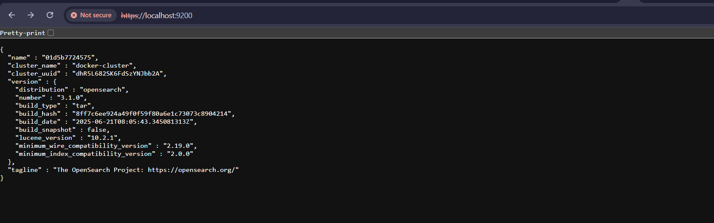
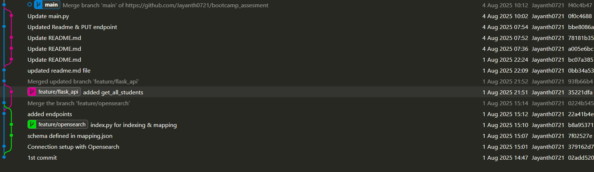
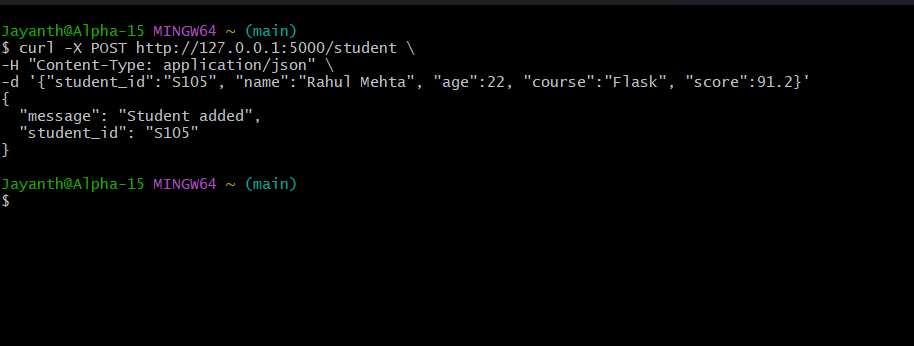

#Setup OpenSearch & OpenSearch-dashboard

##Step 1:
- use Docker/Podman, here i have used Podman. Most of the Podman Commands are same as Docker commands.

- I have Installed & run docker compose file by running podman compose up -d

- After executing that command, Opensearch & Opensearch Dashboard starts running in the port 9200 = data API, 9600 = metrics/monitoring, 5601 = GUI (Dashboards). 

- Username:admin, Password:Str0ng@Passw0rd!

[!]

##Step 2:
- Create Index and Insert Sample Data for that i have used mapping.json for define schema, index.py for creating index & insert sample data.

[!]

##Step 3: 
- Create Flask API and added end points to perform POST, GET, DELETE operations (I'm using flask locally & installed required packages).

##Step 4: Git Version Control
- Here i have created 2 feature banches: 
    1. feature/opensearch for opensearch index mapping & script to load sample data
    2. feature/flask_api for Implemented Flask API for student records

- Images Git Commits

[!]

[!]

[!]

- To list all data for the student index: curl -X GET http://127.0.0.1:5000/student

